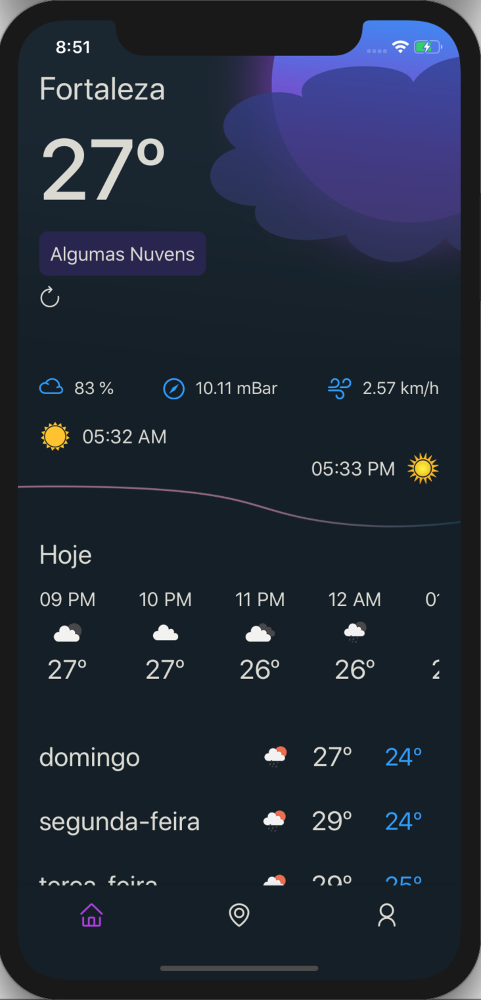
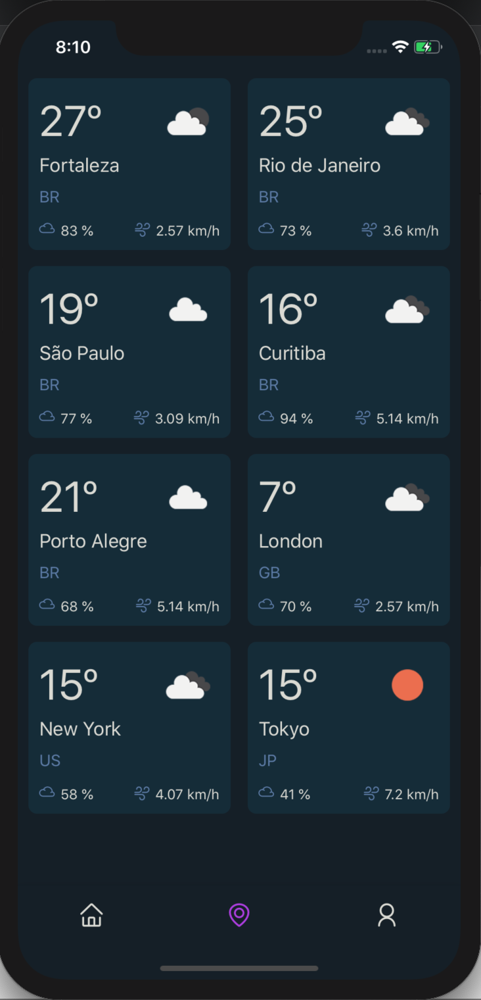
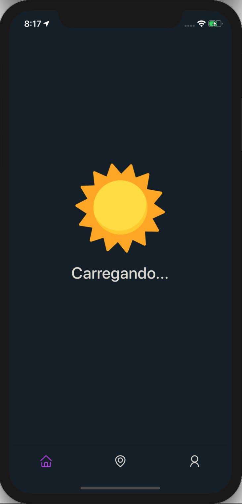
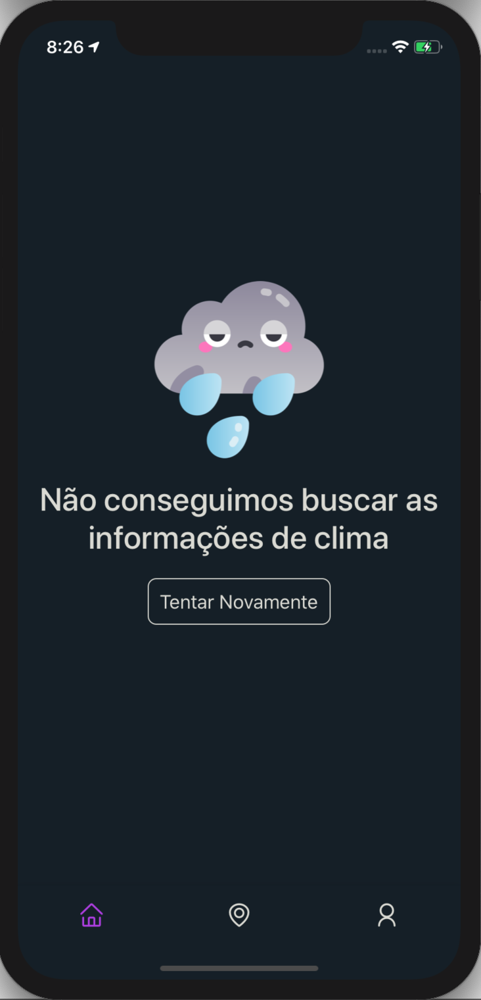
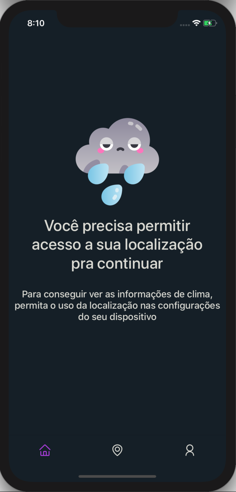

<div align="center">

<h1>Weather App</h1>

</div>

# :question: Sobre

WeatherApp é um aplicativo contruído para consumir a api OpenWeather(https://openweathermap.org/api). Por ele é possível consultar algumas informações de clima da localização atual do usuário, além do clima de algumas cidades ao redor do mundo.
O WeatherApp foi construído utilizando **React Native**.

# :floppy_disk: Instalação

**Baixe o repositório e acesse a pasta do projeto na sua máquina local**

```
1. git clone https://github.com/alissonlimadev/weather-app.git
2. cd weather-app
```

**Instale as dependências e rode o projeto**<br>
- iOS

```
1. yarn install
2. npx pod-install
3. yarn ios
```
obs: A lib usada para recursos de geolocalização já tem suporte ao iOS 14+. Essa versão do iOS vem com uma nova feature que utiliza a variável global [kCLLocationAccuraryReduced](https://developer.apple.com/documentation/corelocation/kcllocationaccuracyreduced) para melhorias de precisão da localização do dispositivo. Então para executar o código é necessário que tenha instalado o Xcode 12.x.x pois é essa versão que tem suporte ao iOS 14+.


- Android

```
1. yarn install
2. yarn android
```

# :computer: Tecnologias

- [React Native](https://reactnative.dev)
- [React Navigation](https://reactnavigation.org)
- [Styled Components](https://styled-components.com)
- [Axios](https://github.com/axios/axios)
- [React Native Geolocation Service](https://github.com/Agontuk/react-native-geolocation-service)

O projeto visou entregar um aplicativo funcional com a menor quantidade possível de bibliotecas objetivando demonstrar domínio na construção de componentes e estilização com a lib Styled-components.

# :triangular_ruler: Design e Protótipo

A interface do aplicativo foi baseada em uma arte conceitual encontrada no site [Dribbble](https://dribbble.com). O protótipo pode ser acessado pelo [link](https://dribbble.com/shots/15292603-Weather-Conceptual-App-Design)

# :star: Aplicativo

### Home

<div align="center">
   
</div>

### Cidades

<div align="center">
    
</div>

### Decorações

<div align="center">
    
     
     
</div>

</div>
